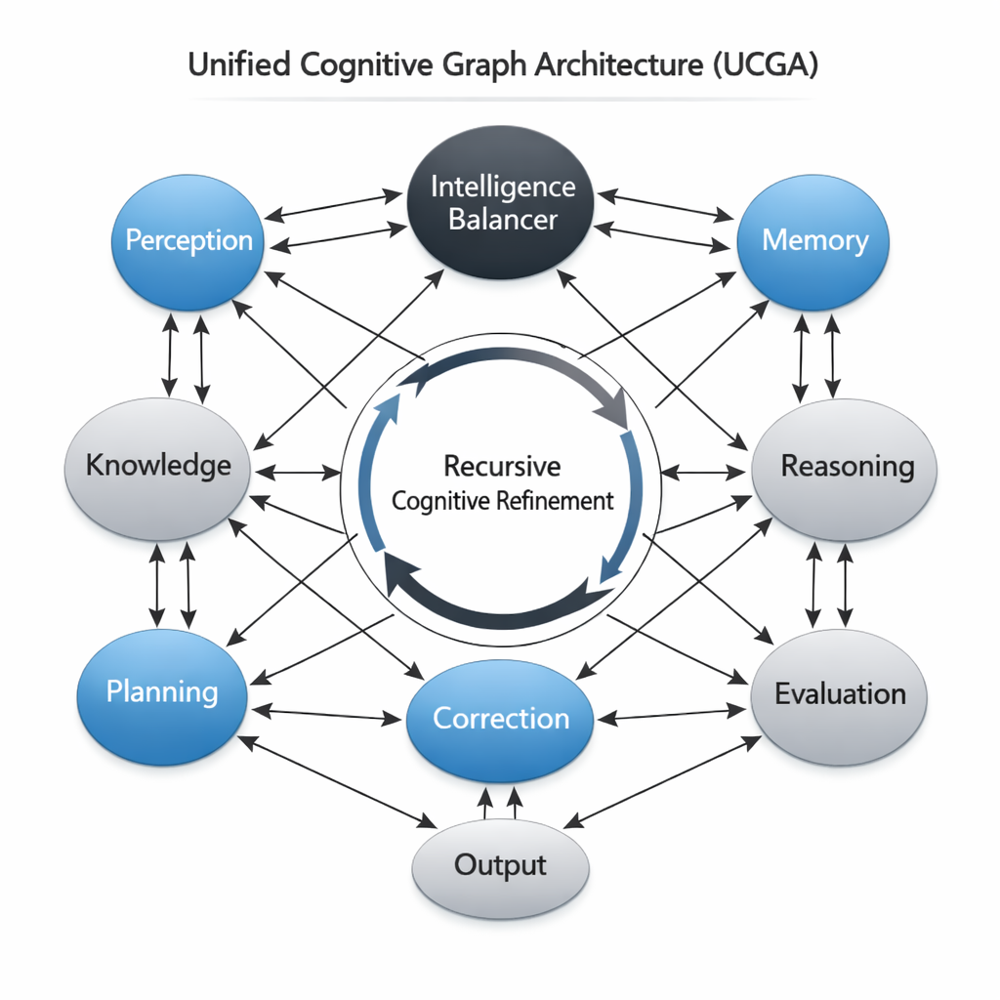

<p align="center">
  
</p>

<h1 align="center">Unified Cognitive Graph Architecture (UCGA)</h1>

<p align="center">
Graph-Native Cognitive Architecture for Artificial General Intelligence, Cognitive Agents, and Multimodal Intelligence Systems
</p>

<p align="center">
  
  
  
  
  
</p>

---

## Overview

Unified Cognitive Graph Architecture (UCGA) is a novel artificial intelligence architecture that models intelligence as a dynamic cognitive graph rather than a fixed sequence of neural network layers.

UCGA introduces a new paradigm where intelligence emerges from recursive interaction between specialized cognitive nodes such as perception, memory, reasoning, planning, and evaluation.

This repository contains the research prototype, architecture design, mathematical formulation, implementation framework, and research paper.

---

## Core Architecture

UCGA models intelligence as a cognitive graph:

G = (V, E, W, S, M)


Where:

- **V** — Cognitive Nodes  
- **E** — Connections between nodes  
- **W** — Adaptive learnable weights  
- **S** — Cognitive state representation  
- **M** — Persistent memory system  

Each cognitive node performs specialized cognitive functions and interacts recursively with other nodes.

---

## Architecture Visualization

<p align="center">
  
</p>

---

## Key Features

- Graph-native cognitive architecture  
- Recursive reasoning framework  
- Persistent memory integration  
- Modular and scalable cognitive node design  
- PyTorch prototype implementation  
- Language reasoning framework (in progress)  
- Multimodal reasoning support (planned)  
- Research-grade architecture documentation  

---

## Repository Structure

UCGA/
│
├── figures/ # Logo and visual assets
│ └── ucga_logo.png
│
├── paper/ # Research paper and figures
│ ├── main.tex
│ ├── UCGA_AGI_Paper.pdf
│ └── figures/
│
├── ucga/ # Core architecture implementation
│ ├── nodes/
│ ├── memory/
│ ├── encoders/
│ └── ucga_model.py
│
├── training/ # Training scripts
│ ├── train_synthetic.py
│ ├── train_language.py
│ └── train_visual.py
│
├── agents/ # Cognitive agent framework
│ └── cognitive_agent.py
│
├── experiments/ # Experimental validation
│
├── utils/ # Utilities and tools
│
├── requirements.txt
├── LICENSE
└── README.md


---

## Installation

Clone the repository:

```bash
git clone https://github.com/YOUR_USERNAME/UCGA.git
cd UCGA
Install dependencies:

pip install -r requirements.txt
Running the Prototype
Synthetic reasoning prototype:

python training/train_synthetic.py
Language reasoning prototype:

python training/train_language.py
Research Paper
Research paper available at:

paper/UCGA_AGI_Paper.pdf
LaTeX source:

paper/main.tex
Development Status
Completed
Architecture definition

Mathematical formulation

Prototype implementation

Persistent memory system

Recursive reasoning framework

Research paper draft

In Progress
Language reasoning system

Multimodal integration

Planned
Autonomous cognitive agents

Large-scale AGI training

Full multimodal intelligence integration

Research Vision
UCGA explores a new architectural paradigm where intelligence is modeled as a dynamic cognitive graph rather than static neural layers.

The long-term objective is to develop scalable cognitive architectures capable of:

Adaptive reasoning

Persistent learning

Cross-domain intelligence

Autonomous cognitive agents

Artificial General Intelligence

Author
Aman Singh
Founder, UCGA Research Initiative

Independent AI Researcher

Acknowledgments
Development supported by AI-assisted research and development tools including Gemini and GPT-5.2 for implementation guidance, documentation support, and research structuring.

All architectural design and research direction were defined and developed by the author.

License
MIT License

Copyright (c) 2026 Aman Singh

Singh, Aman.
Unified Cognitive Graph Architecture (UCGA):
A Graph-Native Cognitive Framework for Artificial General Intelligence.
2026.
